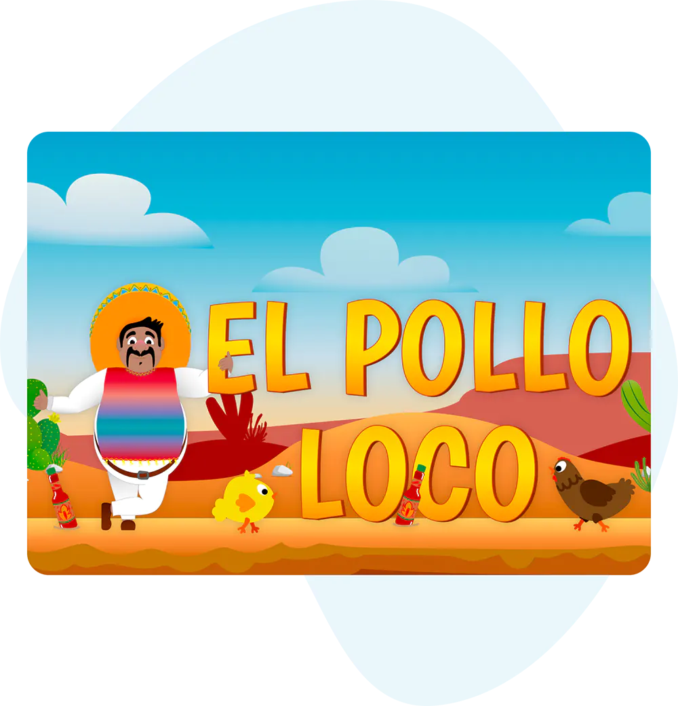

# El Pollo Loco

    <strong>Is your salsa prepared, cabrón?</strong>

<a href="https://svenprimus.developerakademie.net/el-pollo-loco/index.html" target="_blank">VAMOS!</a>

#

<i align="left">
    Old Don Pepe had a rancho, 
    Ei-Ai-Ei-Ay-Ó! 
     
    And on that rancho he had some gallos, 
    Ei-Ai-Ei-Ay-Ó! 
     
    With an "qui-qui" here,  
    And an "ri-ri" there, 
    Here an "qui-qui", there an "ri-quí" 
    Everwhery "¡Qui-qui-ri-quí!" 
     
    Old Don Pepe had a rancho, 
    Ei-Ai-Ei-Ay-Ó! 
<i>
